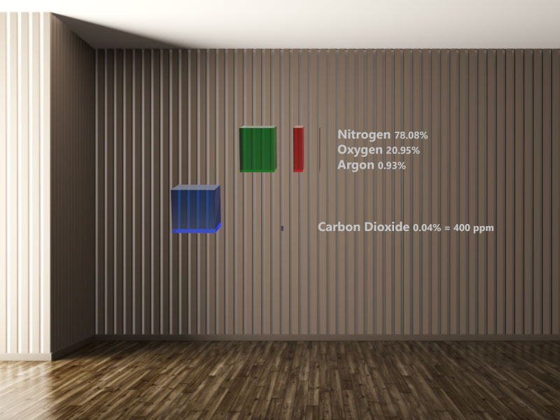

# See O Too

See O Too is an augmented reality application (currently on the HoloLens), that visually and immersively shows the composition of earth's atmosphere and how human activity is changing it. Understanding the atmosphere and how rapidly we are altering it provides the foundation for understanding climate change.

*Note: Storyboard render - not yet live code*
## Status
This is a new project, started in May 2018. The first milestone is to get a basic experience up and running to test with a variety of users to see if AR is an understandable and compelling way to communicate this material.

See the [changelog](CHANGELOG.md) for current status and roadmap.

## Storyboards
See the [first storyboard](Storyboards/storyboard001.md) for a very preliminary description and design of the first experience being prototyped.