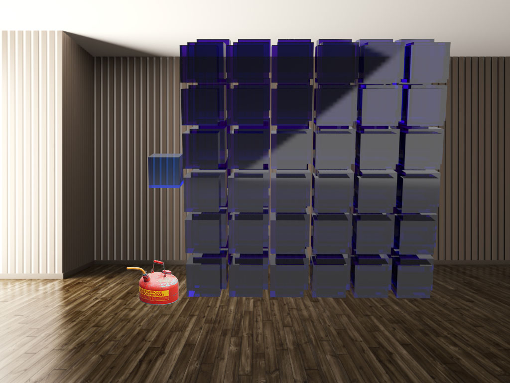

# See O Too

See O Too is an augmented reality application (currently on the HoloLens), that visually and immersively shows the composition of earth's atmosphere and how human activity is changing it. Understanding the atmosphere and how rapidly we are altering it provides the foundation for understanding climate change.

*Note: This a render for the [Storyboard](Storyboards/storyboard001.md) - it's not yet live code*

## Storyboards
To get an idea of what the proect is about, **check out the [first storyboard](Storyboards/storyboard001.md)** for a preliminary description and design for the first experience being prototyped.

## Eyeo Festival 2018
I am attending Eyeo 2018 from June 4-7 and I'll be giving informal demos of the current prototype in-between sessions. I am very interested in getting feedback from Eyeo attendees. Please message me in the Eyeo app if you're interested in a demo.

## Status
This is a new project, started in May 2018. The first milestone is to get a basic experience up and running to test with a variety of users to see if AR is an understandable and compelling way to communicate this material.

See the [changelog](CHANGELOG.md) for current status of the code and roadmap.

