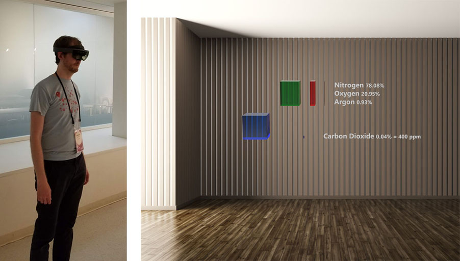

# See O Too

See O Too is an augmented reality application that visually and immersively teaches the fundamentals of Climate Science.

## Experience
The core See O Too experience is a self-paced, narrated, visual exploration with simple interactivity. It is intended for museums, classrooms, or festivals and can be used with no prior exposure to AR or VR. It currently runs on the Microsoft HoloLens. The HoloLens allows the user to directly explore the room-sized 3D visualizations by moving through them and looking around them.

The content and terminology is designed for middle school science students through adults and the experience can be completed in about 10 minutes.

You can download a video of a capture through the HoloLens of the **current crude prototype [from this page](Videos/SeeOToo-HoloLensCaptureV004).**

## The Project
See O Too is an open source project (MIT license) developed in Unity3D and hosted on GitHub.

It’s being developed on a volunteer basis and is currently without external funding or partnerships.

We are seeking interested collaborators, particularly artists, animators, or developers with Unity3D expertise.

## Design Principles
- Journalistic approach
- Scientific reality, not advocacy
- Open content methodology
	- References published on GitHub
    - Design decisions documented on GitHub
- Extreme clarity about directly measured data versus projections and areas of active research
	- Data example: Current atmospheric CO2 concentration
	- Active research example: Greenland ice sheet melt rate

## Guided Experience
### Three Chapters
1. Gasses and the Atmosphere
   - This is the chapter currently being prototyped
1. Warming and Melting
1. Effects and Mitigation

## Status
This is a new project, started in May 2018. The first milestone is to get a basic version of Chapter 1 up and running to test with a variety of users to see if AR is an understandable, usable, and compelling way to communicate this material.

## More Info
* **[Overview presentation about the project](Storyboards-VOScripts/Overview_Presentation.pdf)**
* See the **[changelog](CHANGELOG.md)** for current status of the code and roadmap.
* **[Preliminary storyboard/script for Chapter 1](Storyboards-VOScripts/storyboard001.md)** *(out of date)*

## References, Data, and Methodology
*TBD*

## Thanks and Acknowledgements
* Thanks to the people I met at the **[2018 Eyeo Festival](http://eyeofestival.com/)** and the **[Code+Climate Summit](http://eyeofestival.com/summit)** who bravely tried out the very first prototypes and gave me great feedback, ideas, and encouragement.
