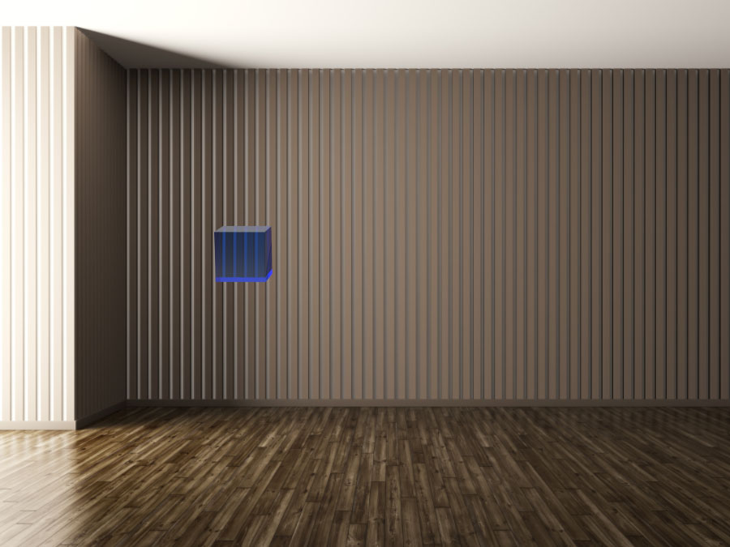
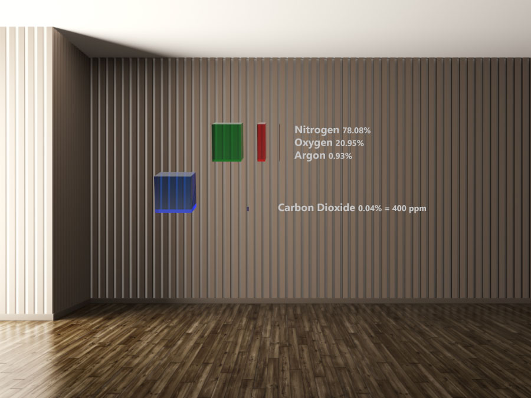
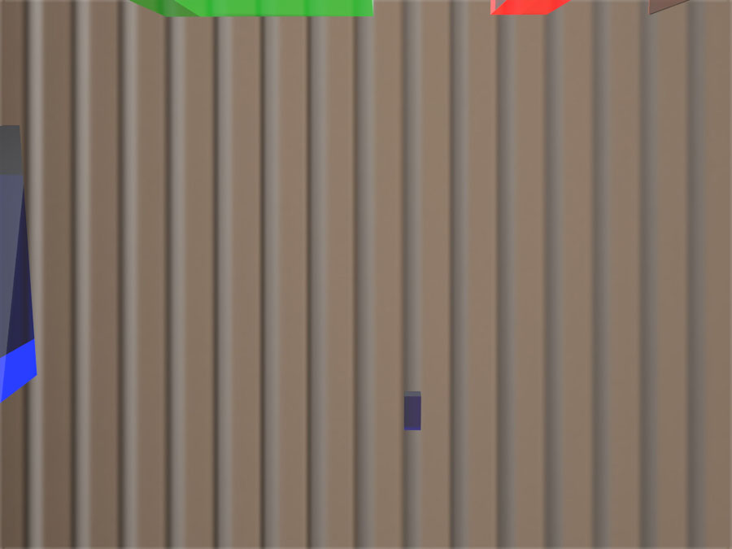
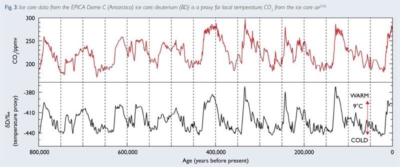
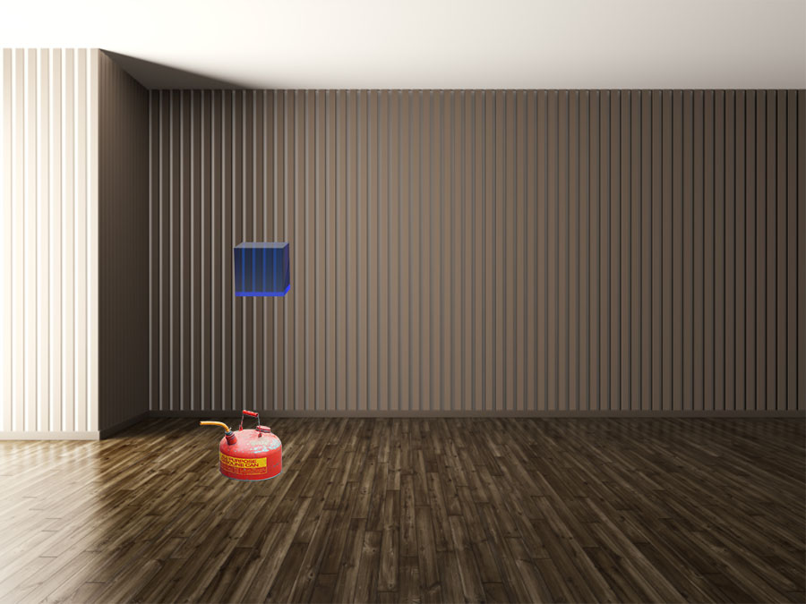
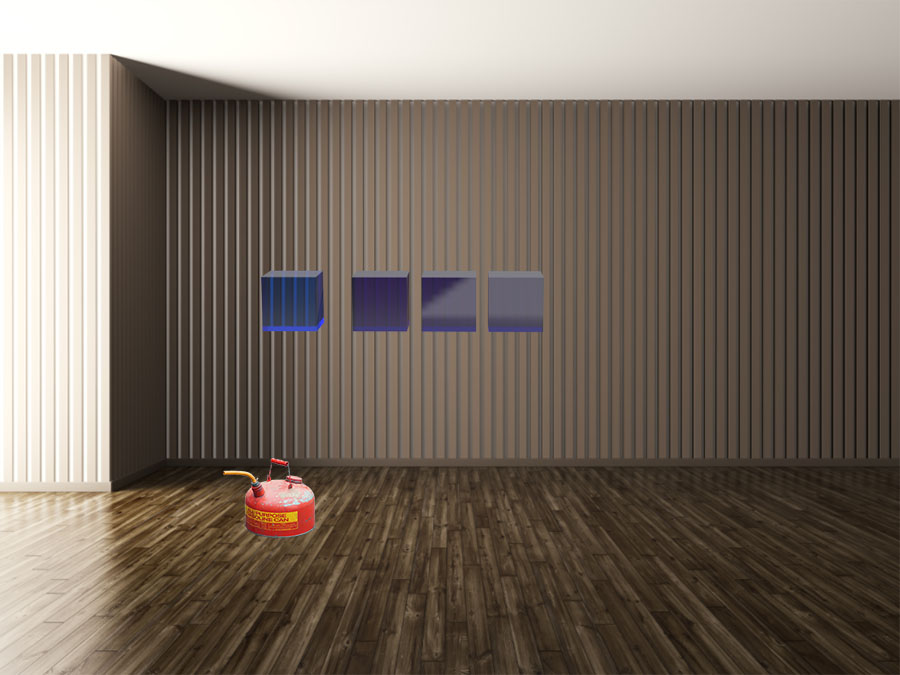
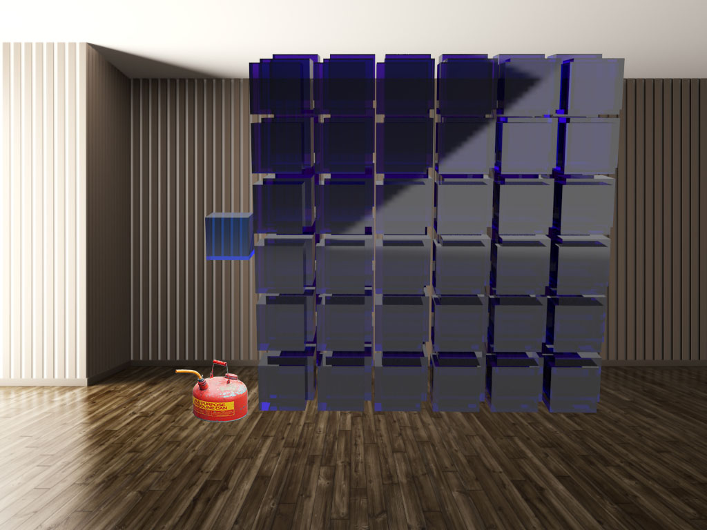

# Storyboard

***This is badly out of date - see [Issue #4](https://github.com/ezocher/seeotoo/issues/4)***

***Please download the video [from this page](Videos/SeeOToo-HoloLensCaptureV004.mp4) to get a more current overview of the experience***

The first prototype of See O Too will implement a small portion of the start of the guided (non-interactive) experience. Future versions will have a guided mode and an interactive mode and have ways to switch between them.

The left columns of the tables below have the voiceover narration script and the right columns describe what happens visually.

### One cubic foot of air

| Narration | Description |
|:---------|:--------------|
| The box floating in front of you contains one cubic foot of air. Let's take a look at what's inside. | One cubic foot blue transparent cube appears centered in front of the user |

### Nitrogen, Oxygen, and Argon

| Narration | Description |
|:----------|:------------|
| The majority of air is Nitrogen, a colorless, odorless gas that is important to plant growth. The next most abundant gas is Oxygen. Animals and humans breathe it and plants produce it as a byproduct of photosynthesis. Argon, a gas which undergoes almost no chemical reactions, makes up almost 1% of the atmosphere. It has no biological function, but we use it in lighting and lasers. Together these three gasses make up over 99% of the atmosphere. | Divide the cube of air into scaled sub-shapes for each gas one-by-one as they are introduced. Show floating text with the name of the gas and its percentage. Use a different color for each gas: N = greenish, O = redish, Ar = orangeish. Future things: surround the original cube of air with a wireframe outline, divide and animate the shape for each gas out of the original cube as it's introduced. Show a sphere-based mollecular model of each gas floating next to its cube. |

### Carbon Dioxide now and historically

| Narration | Description |
|:----------|:------------|
| Next we come to Carbon Dioxide, which is the molecule CO2: one carbon atom with two oxygen atoms attached. The purple box contains the current amount of CO2 that's in one cubic foot of air (407 ppm). | I assume that most people will move close to the cubes as they start to animate/appear so they will be able to see the carbon dioxide cube (if they don't I can ask them to move closer in the narration). The storyboard frame above shows the view when the user moves closer. Animate the carbon dioxide box as we have with the previous gasses and provide floating text as before. |
| Carbon dioxide is used by all plants as it's a necessary ingredient for photosynthesis. The gasses in air are all transparent to visible light, but some gasses, like CO2 are not transparent to infrared light, which is the light which we can't see but we feel as heat. The sun gives off half its energy as infrared light (IR). Carbon dioxide is very effective at absorbing this infrared light, which raises its temperature, which then heats up the other gasses in the air. This property makes CO2 a greenhouse gas. | Future thing: show an electromagnetic spectrum (IR plus visible light rianbow) and show CO2 absorbing IR rays. |
|For the past several thousand years, there was this much CO2 (280 ppm). It began to grow to the current level around 180 years ago and half of the total growth has happened in the last 33 years. |  Scale the box to the corresponding height as the historical changes are described and add the corresponding numbers to the floating text. Future thing to consider: animate the box height in sync with a running display of the year (1800 -> 2018). |

### CO2 versus temperature from ice cores

*In this first prototype this graph will be described but not shown*

| Narration | Description |
|:----------|:------------|
|***TBD*** *Notes: ice ages were ~185 ppm CO2 at lowest and 9 deg C colder than interglacial warming peaks of 280 ppm; industrialization started at a 280 ppm peak* | ***TBD*** |

### Burning one gallon of gasoline

*These storyboard frames show a photo of a 2 1/2 gallon gas can. Later versions will use a 3D model of a 1 gallon gas container at exact scale.*

| Narration | Description |
|:----------|:------------|
| The atmosphere seems really big, how could humans be changing it? Here's one example: this is one gallon of gasoline and it contains about 1 pound of hydrogen and about 5.3 pounds of carbon. It gets combusted with oxygen from the air and primarily creates water vapor (H2O) from the hydrogen and carbon dioxide (CO2) from the carbon. | |

| Narration | Description |
|:----------|:------------|
| Burning this one gallon of gasoline produces 18.9 pounds of carbon dioxide gas. This is enough gas to completely fill 165 cubes with CO2. | Start showing the 165 cubes one by one at an ever increasing pace. |

| Narration | Description |
|:----------|:------------|
| This is enough carbon dioxide to double the CO2 concentration in 406,000 cubes. |  |