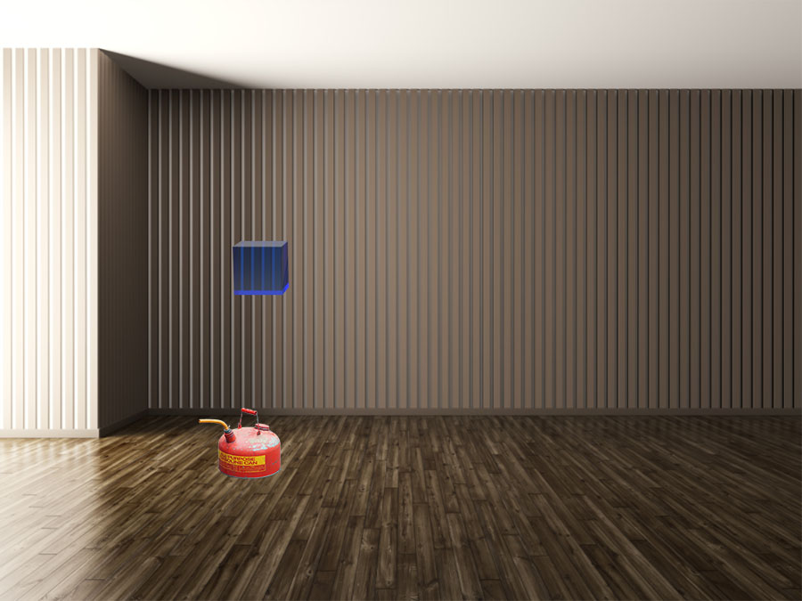
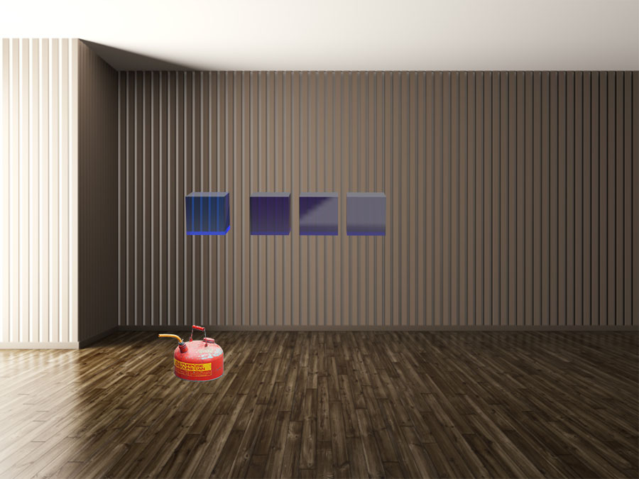

# Narration Script

### One cubic foot of air
The box floating in front of you contains one cubic foot of air.

You can move your head or walk closer for a better view.

When you're ready to see what's inside the box, say "Next".

### Nitrogen, Oxygen, and Argon
The majority of air is Nitrogen, a colorless, odorless gas that is important to plant growth.

When you're ready to continue, say "Next".

The next most abundant gas is Oxygen. Animals and humans breathe it and plants produce it as a byproduct of photosynthesis.

Argon, a gas which undergoes almost no chemical reactions, makes up almost 1% of the atmosphere. It has no biological function, but we use it in lighting and lasers.

Together these three gasses make up over 99% of the atmosphere.

### Water Vapor
Water is constantly cycling through the atmosphere. Water evaporates from the Earth's surface and rises on warm updrafts into the atmosphere. It condenses into clouds, is blown by the wind, and then falls back to the Earth as rain or snow. This cycle is one important way that heat and energy are transferred from the surface of the Earth to the atmosphere, and transported from one place to another on our planet.

Water vapor is also the most important greenhouse gas in the atmosphere. Heat radiated from Earth's surface is absorbed by water vapor molecules in the lower atmosphere. The water vapor molecules, in turn, radiate heat in all directions. Some of the heat returns to the Earth's surface. Thus, water vapor is a second source of warmth (in addition to sunlight) at the Earth's surface.

### Carbon Dioxide now and historically
Now we come to Carbon Dioxide, which is the molecule CO2: one carbon atom with two oxygen atoms attached. The purple box contains the current amount of CO2 that's in one cubic foot of air. 

Carbon dioxide is used by all plants as it's a necessary ingredient for photosynthesis.

The gasses in air are all transparent to visible light, but some gasses, like CO2 are not transparent to infrared light, which is the light which we can't see but we feel as heat.

The sun gives off half its energy as infrared light.

Carbon dioxide is very effective at absorbing this infrared light, which raises its temperature, which then heats up the other gasses in the air.

This property makes CO2 a greenhouse gas.

Without this greenhouse effect, Earth would be an ice planet with an average temperature of zero degrees fahrenheit. This small amount of greenhouse gas is enough to warm the earth to the current 57 degree average and increa

|For the past several thousand years, there was this much CO2 (280 ppm). It began to grow to the current level around 180 years ago and half of the total growth has happened in the last 33 years. |  Scale the box to the corresponding height as the historical changes are described and add the corresponding numbers to the floating text. Future thing to consider: animate the box height in sync with a running display of the year (1800 -> 2018). |

### CO2 versus temperature from ice cores

*In this first prototype this graph will be described but not shown*

| Narration | Description |
|:----------|:------------|
|***TBD*** *Notes: ice ages were ~185 ppm CO2 at lowest and 9 deg C colder than interglacial warming peaks of 280 ppm; industrialization started at a 280 ppm peak* | ***TBD*** |

### Burning one gallon of gasoline

*These storyboard frames show a photo of a 2 1/2 gallon gas can. Later versions will use a 3D model of a 1 gallon gas container at exact scale.*

| Narration | Description |
|:----------|:------------|
| The atmosphere seems really big, how could humans be changing it? Here's one example: this is one gallon of gasoline and it contains about 1 pound of hydrogen and about 5.3 pounds of carbon. It gets combusted with oxygen from the air and primarily creates water vapor (H2O) from the hydrogen and carbon dioxide (CO2) from the carbon. | |

| Narration | Description |
|:----------|:------------|
| Burning this one gallon of gasoline produces 18.9 pounds of carbon dioxide gas. This is enough gas to completely fill 165 cubes with CO2. | Start showing the 165 cubes one by one at an ever increasing pace. |

| Narration | Description |
|:----------|:------------|
| This is enough carbon dioxide to double the CO2 concentration in 406,000 cubes. |  |